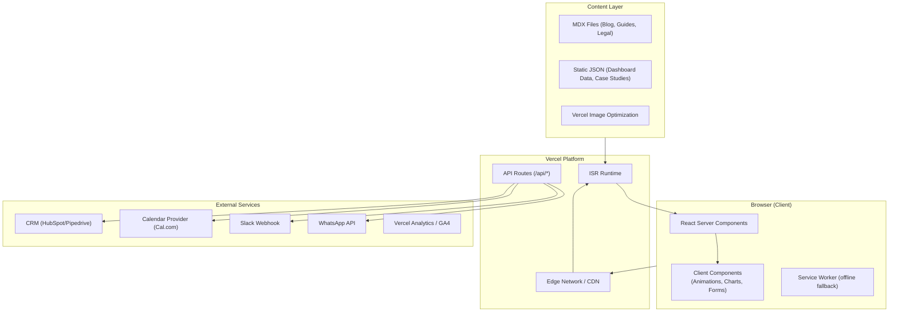
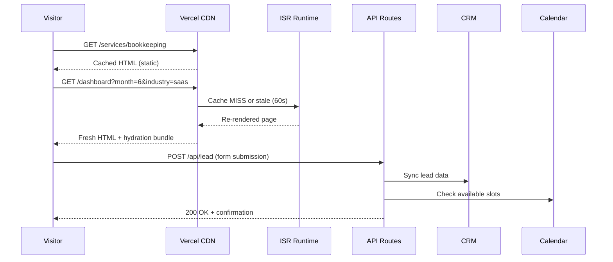

# Design Document: Finofii Edge Website

## Overview

Finofii Edge is a 16-page marketing and product website for a US-focused accounting/bookkeeping firm targeting DTC brands, agencies, SaaS startups, and CPA firms. The site employs an editorial design direction with world-class animations, scroll-triggered effects, interactive dashboards, and qualified lead capture — all built on Next.js 14 (App Router), TypeScript, Tailwind CSS v4, GSAP, Framer Motion, and Recharts, hosted on Vercel.

The architecture prioritizes:
- **Static-first rendering** — pages are statically generated at build time; ISR handles dynamic content (dashboard demo, case studies)
- **Progressive enhancement** — all content is accessible without JavaScript; animations layer on top
- **Design system consistency** — a single source of truth for tokens, typography, and components
- **Performance** — sub-200KB JS bundles, lazy-loaded below-fold content, Lighthouse 90+ desktop / 80+ mobile

### Key Design Decisions

| Decision | Rationale |
|----------|-----------|
| Next.js App Router | File-system routing, React Server Components for zero-JS content pages, built-in ISR, Vercel-native deployment |
| Tailwind CSS v4 | Utility-first with design token layer via CSS custom properties; tree-shakes unused styles |
| GSAP + Framer Motion coexistence | GSAP for scroll-triggered sequences and timeline control; Framer Motion for layout animations and page transitions |
| Recharts | Lightweight, composable chart library with built-in responsive container; SSR-compatible |
| MDX via next-mdx-remote | Supports embedded interactive components inside blog/guide content without custom CMS |
| Vercel Edge + ISR | Global CDN, instant cache invalidation, 60s revalidation for dynamic pages |

---

## Architecture

### High-Level System Diagram



### Request Flow



### Phased Delivery

| Phase | Pages | Key Capabilities |
|-------|-------|------------------|
| **A** | Home, Services Hub, Bookkeeping, Dashboards, Pricing, Sample Dashboard, Security, Book a Free Audit, Legal (4) | Core design system, animation engine, lead capture, dashboard demo |
| **B** | Industry pages (4), Virtual CFO, Entity & Compliance, How It Works, Case Studies | Industry personalization, expanded service pages, case study filtering |
| **C** | About & Team, Resources (Blog/Guides) | MDX content layer, tax calendar, template downloads |

---

## Components and Interfaces

### Project Structure

```
src/
├── app/                          # Next.js App Router
│   ├── layout.tsx                # Root layout (fonts, providers, nav, footer)
│   ├── page.tsx                  # Home page
│   ├── services/
│   │   ├── page.tsx              # Services hub
│   │   ├── bookkeeping/page.tsx
│   │   ├── dashboards/page.tsx
│   │   ├── cfo/page.tsx
│   │   └── entity/page.tsx
│   ├── pricing/page.tsx
│   ├── dashboard/page.tsx        # Interactive demo dashboard
│   ├── security/page.tsx
│   ├── book/page.tsx             # Lead form + booking widget
│   ├── legal/
│   │   ├── privacy/page.tsx
│   │   ├── terms/page.tsx
│   │   ├── dpa/page.tsx
│   │   └── sub-processors/page.tsx
│   ├── industries/
│   │   ├── dtc/page.tsx
│   │   ├── agencies/page.tsx
│   │   ├── saas/page.tsx
│   │   └── cpa/page.tsx
│   ├── how-it-works/page.tsx
│   ├── case-studies/page.tsx
│   ├── about/page.tsx
│   ├── resources/page.tsx
│   └── api/
│       ├── lead/route.ts         # Lead form submission
│       ├── newsletter/route.ts   # Newsletter signup
│       └── booking/route.ts      # Calendar integration
├── components/
│   ├── design-system/            # Core UI primitives
│   │   ├── Button.tsx
│   │   ├── Card.tsx
│   │   ├── Section.tsx
│   │   ├── Navbar.tsx
│   │   ├── Footer.tsx
│   │   ├── Stat.tsx
│   │   ├── Testimonial.tsx
│   │   ├── PricingTier.tsx
│   │   ├── FormField.tsx
│   │   ├── Toggle.tsx
│   │   ├── Badge.tsx
│   │   ├── Tooltip.tsx
│   │   ├── Accordion.tsx
│   │   ├── Modal.tsx
│   │   ├── AnimatedHeadline.tsx
│   │   └── index.ts              # Barrel export
│   ├── animations/               # Animation primitives
│   │   ├── ScrollReveal.tsx
│   │   ├── ParallaxLayer.tsx
│   │   ├── StaggeredList.tsx
│   │   ├── CounterAnimation.tsx
│   │   ├── MagneticButton.tsx
│   │   ├── CursorFollower.tsx
│   │   └── PageTransition.tsx
│   ├── charts/                   # Chart components
│   │   ├── LineChart.tsx
│   │   ├── BarChart.tsx
│   │   ├── MetricCard.tsx
│   │   ├── ChartContainer.tsx
│   │   └── AccessibleTable.tsx   # Hidden data table for a11y
│   ├── forms/                    # Form components
│   │   ├── LeadForm.tsx
│   │   ├── BookingWidget.tsx
│   │   ├── TierRecommender.tsx
│   │   └── NewsletterSignup.tsx
│   ├── content/                  # Content display
│   │   ├── CaseStudyCard.tsx
│   │   ├── CaseStudyDetail.tsx
│   │   ├── FilterBar.tsx
│   │   ├── Lightbox.tsx
│   │   ├── Timeline.tsx
│   │   ├── FilingCalendar.tsx
│   │   ├── TaxCalendar.tsx
│   │   ├── TableOfContents.tsx
│   │   └── TeamMemberCard.tsx
│   └── layout/                   # Layout components
│       ├── CompactHeader.tsx
│       ├── MobileNavOverlay.tsx
│       ├── StickyTOCSidebar.tsx
│       └── GridContainer.tsx
├── lib/
│   ├── design-tokens.ts          # Token constants + Tailwind plugin
│   ├── animation-engine.ts       # GSAP/FM initialization + helpers
│   ├── chart-data.ts             # Dashboard dataset definitions
│   ├── dashboard-url.ts          # URL encode/decode for shareable state
│   ├── form-validation.ts        # Validation schemas (Zod)
│   ├── tier-recommender.ts       # Tier recommendation algorithm
│   ├── seo.ts                    # Meta tag generation helpers
│   ├── crm-connector.ts          # CRM sync + retry queue
│   ├── calendar-client.ts        # Calendar provider client
│   └── filters.ts                # Case study / resource filtering
├── content/
│   ├── case-studies/             # MDX case study files
│   ├── blog/                     # MDX blog posts
│   ├── guides/                   # MDX guides
│   ├── legal/                    # MDX legal docs
│   └── data/
│       ├── dashboard-dtc.json
│       ├── dashboard-agency.json
│       ├── dashboard-saas.json
│       ├── dashboard-cpa.json
│       └── filing-calendar.json
├── hooks/
│   ├── useScrollReveal.ts
│   ├── useParallax.ts
│   ├── useReducedMotion.ts
│   ├── useIntersectionObserver.ts
│   ├── useDashboardState.ts
│   └── useMediaQuery.ts
├── styles/
│   └── globals.css               # Tailwind directives + custom properties
└── types/
    ├── dashboard.ts
    ├── lead.ts
    ├── case-study.ts
    ├── content.ts
    └── seo.ts
```

### Key Component Interfaces

#### Design System Components

```typescript
// components/design-system/Button.tsx
interface ButtonProps {
  variant: 'primary' | 'secondary' | 'ghost' | 'accent';
  size: 'sm' | 'md' | 'lg';
  disabled?: boolean;
  loading?: boolean;
  magnetic?: boolean;  // Enable magnetic cursor effect
  href?: string;       // Renders as <Link> when provided
  children: React.ReactNode;
  onClick?: () => void;
  ariaLabel?: string;
}

// components/design-system/Card.tsx
interface CardProps {
  variant: 'default' | 'elevated' | 'interactive' | 'pricing';
  expandable?: boolean;
  expanded?: boolean;
  onToggle?: () => void;
  children: React.ReactNode;
  ariaLabel?: string;
}

// components/design-system/Accordion.tsx
interface AccordionProps {
  items: Array<{
    id: string;
    title: string;
    content: React.ReactNode;
  }>;
  allowMultiple?: boolean;
  defaultOpen?: string[];
}

// components/design-system/Modal.tsx
interface ModalProps {
  isOpen: boolean;
  onClose: () => void;
  title: string;
  children: React.ReactNode;
  trapFocus?: boolean;       // Default: true
  returnFocus?: boolean;     // Default: true
  closeOnOverlay?: boolean;  // Default: true
  closeOnEscape?: boolean;   // Default: true
}

// components/design-system/AnimatedHeadline.tsx
interface AnimatedHeadlineProps {
  text: string;
  as?: 'h1' | 'h2' | 'h3';
  animation: 'fade-up' | 'split-chars' | 'typewriter';
  delay?: number;
}
```

#### Animation Components

```typescript
// components/animations/ScrollReveal.tsx
interface ScrollRevealProps {
  children: React.ReactNode;
  animation?: 'fade-up' | 'fade-in' | 'slide-left' | 'slide-right' | 'scale';
  threshold?: number;       // 0-1, default 0.2
  duration?: number;        // ms, default 500
  delay?: number;           // ms, default 0
  stagger?: number;         // ms between children, default 0
  disabled?: boolean;       // For reduced motion
}

// components/animations/ParallaxLayer.tsx
interface ParallaxLayerProps {
  children: React.ReactNode;
  speed: number;            // 0.1 to 0.5
  direction?: 'vertical' | 'horizontal';
  disabled?: boolean;       // Disabled for touch/reduced-motion
}

// components/animations/CounterAnimation.tsx
interface CounterAnimationProps {
  end: number;
  prefix?: string;          // e.g., "$"
  suffix?: string;          // e.g., "%", "+"
  duration?: number;        // ms, max 2000
  decimals?: number;
  triggerOnView?: boolean;
}
```

#### Chart Components

```typescript
// components/charts/ChartContainer.tsx
interface ChartContainerProps {
  title: string;
  description?: string;
  data: ChartDataPoint[];
  accessibleTableData: AccessibleTableRow[];  // Hidden table for screen readers
  children: React.ReactNode;
}

// components/charts/LineChart.tsx
interface FinancialLineChartProps {
  data: ChartDataPoint[];
  xKey: string;
  yKeys: string[];
  colors?: string[];
  animateTransition?: boolean;
  transitionDuration?: number;  // ms, default 300
}
```

#### Form Components

```typescript
// components/forms/LeadForm.tsx
interface LeadFormProps {
  prefilledEntityType?: IndustryType;
  prefilledService?: ServiceType;
  onSubmitSuccess?: (lead: LeadSubmission) => void;
  onSubmitError?: (error: FormError) => void;
}

interface LeadFormStep {
  id: string;
  label: string;
  fields: FormFieldConfig[];
}

// components/forms/BookingWidget.tsx
interface BookingWidgetProps {
  calendarProvider: 'cal.com';
  timezone?: string;             // Auto-detected or user-selected
  minDaysAhead?: number;         // Default: 5 business days
  slotDuration?: number;         // Minutes, default: 30
  onBookingConfirmed?: (booking: BookingConfirmation) => void;
  fallbackContactMethod?: string;
}

// components/forms/TierRecommender.tsx
interface TierRecommenderProps {
  onRecommendation?: (tier: PricingTier) => void;
}

interface TierRecommenderInputs {
  entityType: EntityType;
  monthlyTransactions: TransactionVolume;
  revenueBand: RevenueBand;
}
```

#### Content Components

```typescript
// components/content/FilterBar.tsx
interface FilterBarProps<T extends string> {
  dimensions: FilterDimension<T>[];
  activeFilters: Record<string, T[]>;
  onFilterChange: (dimension: string, values: T[]) => void;
  onReset: () => void;
}

interface FilterDimension<T extends string> {
  key: string;
  label: string;
  options: Array<{ value: T; label: string }>;
  multiple?: boolean;
}
```

### API Route Interfaces

```typescript
// app/api/lead/route.ts
// POST /api/lead
interface LeadSubmissionPayload {
  entityType: EntityType;
  revenueBand: RevenueBand;
  currentTool: AccountingTool;
  timezone: string;
  email: string;
  companyName?: string;
}

interface LeadSubmissionResponse {
  success: boolean;
  leadId: string;
  message: string;
}

// app/api/newsletter/route.ts
// POST /api/newsletter
interface NewsletterPayload {
  email: string;  // Max 254 chars, standard email format
}

// app/api/booking/route.ts
// GET /api/booking/slots?timezone={tz}&date={date}
interface BookingSlot {
  startTime: string;  // ISO 8601
  endTime: string;
  available: boolean;
}

// POST /api/booking
interface BookingPayload {
  slotId: string;
  leadId: string;
  timezone: string;
}
```

---

## Data Models

### Core Types

```typescript
// types/dashboard.ts
type IndustryType = 'dtc' | 'agency' | 'saas' | 'cpa';
type MonthIndex = 1 | 2 | 3 | 4 | 5 | 6 | 7 | 8 | 9 | 10 | 11 | 12;

interface DashboardState {
  month: MonthIndex;
  industry: IndustryType;
}

interface ChartDataPoint {
  label: string;
  [key: string]: string | number;
}

interface DashboardDataset {
  industry: IndustryType;
  months: Record<MonthIndex, MonthData>;
}

interface MonthData {
  revenue: ChartDataPoint[];
  expenses: ChartDataPoint[];
  cashFlow: ChartDataPoint[];
  summaryMetrics: SummaryMetric[];
}

interface SummaryMetric {
  label: string;
  value: number;
  prefix?: string;
  suffix?: string;
  trend: 'up' | 'down' | 'flat';
  trendValue: number;
}
```

```typescript
// types/lead.ts
type EntityType = 'llc' | 'scorp' | 'ccorp' | 'sole_prop' | 'partnership';
type RevenueBand = 'pre_revenue' | '0_100k' | '100k_500k' | '500k_1m' | '1m_5m' | '5m_plus';
type AccountingTool = 'quickbooks' | 'xero' | 'wave' | 'freshbooks' | 'spreadsheet' | 'none';
type TransactionVolume = 'under_50' | '50_200' | '200_500' | '500_1000' | 'over_1000';
type PricingTier = 'essentials' | 'growth' | 'scale';

interface LeadSubmission {
  id: string;
  entityType: EntityType;
  revenueBand: RevenueBand;
  currentTool: AccountingTool;
  timezone: string;
  email: string;
  companyName?: string;
  submittedAt: string;  // ISO 8601
  source: string;       // Page path
  prefilledIndustry?: IndustryType;
}
```

```typescript
// types/case-study.ts
interface CaseStudy {
  id: string;
  slug: string;
  industry: IndustryType;
  serviceType: ServiceType;
  headline: string;
  clientIndustryLabel: string;
  problem: string;
  solution: string;
  metrics: BeforeAfterMetric[];
  publishedAt: string;
}

type ServiceType = 'bookkeeping' | 'mis' | 'cfo' | 'entity';

interface BeforeAfterMetric {
  label: string;
  before: number;
  after: number;
  unit: string;      // "$", "%", "days", etc.
  improvement: string; // e.g., "3x faster"
}
```

```typescript
// types/seo.ts
interface PageSEO {
  title: string;        // Max 60 chars
  description: string;  // Max 160 chars
  ogTitle: string;
  ogDescription: string;
  ogImage: string;
  ogUrl: string;
  canonical: string;
}
```

```typescript
// types/content.ts
type ContentType = 'blog' | 'guide' | 'template' | 'tax_calendar';

interface ContentItem {
  id: string;
  slug: string;
  title: string;
  type: ContentType;
  publishDate: string;
  excerpt: string;
  category: string;
  tags: string[];
}

interface FilingDeadline {
  month: MonthIndex;
  name: string;
  dueDate: string;       // "MM/DD" format
  description: string;   // One sentence
  entityTypes: EntityType[];
}

interface TeamMember {
  id: string;
  name: string;
  role: string;
  photoUrl: string;
  bio: string;           // Max 150 chars
  order: number;
}
```

### Dashboard URL Encoding/Decoding

```typescript
// lib/dashboard-url.ts

/**
 * Encodes dashboard state into URL query parameters.
 * Example: { month: 6, industry: 'saas' } → "?month=6&industry=saas"
 */
export function encodeDashboardState(state: DashboardState): string;

/**
 * Decodes URL search params into validated DashboardState.
 * Falls back to defaults (month: current, industry: 'dtc') for invalid params.
 */
export function decodeDashboardState(params: URLSearchParams): DashboardState;

/**
 * Validates that a month value is a valid MonthIndex (1-12).
 */
export function isValidMonth(value: unknown): value is MonthIndex;

/**
 * Validates that an industry value is a recognized IndustryType.
 */
export function isValidIndustry(value: unknown): value is IndustryType;
```

### Tier Recommender Algorithm

```typescript
// lib/tier-recommender.ts

/**
 * Scoring weights for tier recommendation:
 * - Transaction volume has highest weight (determines operational complexity)
 * - Revenue band indicates growth stage
 * - Entity type influences compliance needs
 *
 * Score ranges:
 * - Essentials: 0-3
 * - Growth: 4-6
 * - Scale: 7+
 */
export function recommendTier(inputs: TierRecommenderInputs): PricingTier;

/**
 * Returns the numeric score for the given inputs (useful for testing).
 */
export function calculateTierScore(inputs: TierRecommenderInputs): number;
```

### Form Validation (Zod Schemas)

```typescript
// lib/form-validation.ts
import { z } from 'zod';

export const leadFormSchema = z.object({
  entityType: z.enum(['llc', 'scorp', 'ccorp', 'sole_prop', 'partnership']),
  revenueBand: z.enum(['pre_revenue', '0_100k', '100k_500k', '500k_1m', '1m_5m', '5m_plus']),
  currentTool: z.enum(['quickbooks', 'xero', 'wave', 'freshbooks', 'spreadsheet', 'none']),
  timezone: z.string().min(1).max(50),
  email: z.string().email().max(254),
  companyName: z.string().max(200).optional(),
});

export const newsletterSchema = z.object({
  email: z.string().email().max(254),
});

/**
 * Validates a single step of the multi-step lead form.
 * Returns field-level errors for inline display.
 */
export function validateLeadStep(
  step: number,
  data: Partial<LeadSubmission>
): ValidationResult;

interface ValidationResult {
  valid: boolean;
  errors: Record<string, string>;
}
```

### SEO Metadata Generation

```typescript
// lib/seo.ts

/**
 * Generates SEO metadata for a given page.
 * Truncates title to 60 chars and description to 160 chars.
 * Falls back to site-wide defaults if inputs are empty/missing.
 */
export function generatePageSEO(input: {
  title: string;
  description: string;
  path: string;
  ogImage?: string;
}): PageSEO;

/**
 * Truncates a string to maxLength, appending "…" if truncated.
 * Ensures the result does not exceed maxLength characters.
 */
export function truncateWithEllipsis(text: string, maxLength: number): string;
```

### Case Study / Resource Filtering

```typescript
// lib/filters.ts

/**
 * Filters case studies by industry and service type.
 * Returns all items if no filters are active.
 */
export function filterCaseStudies(
  items: CaseStudy[],
  filters: { industry?: IndustryType[]; serviceType?: ServiceType[] }
): CaseStudy[];

/**
 * Filters content items by content type(s).
 * Returns all items if no filter is active.
 * Applies pagination (page, pageSize).
 */
export function filterContent(
  items: ContentItem[],
  filters: { types?: ContentType[] },
  pagination: { page: number; pageSize: number }
): { items: ContentItem[]; total: number; totalPages: number };
```

---


## Correctness Properties

*A property is a characteristic or behavior that should hold true across all valid executions of a system — essentially, a formal statement about what the system should do. Properties serve as the bridge between human-readable specifications and machine-verifiable correctness guarantees.*

### Property 1: Dashboard URL State Round-Trip

*For any* valid `DashboardState` (month in 1–12, industry in `['dtc', 'agency', 'saas', 'cpa']`), encoding the state to URL query parameters via `encodeDashboardState` and then decoding those parameters via `decodeDashboardState` SHALL produce a state equivalent to the original.

**Validates: Requirements 8.4**

### Property 2: Dashboard URL Invalid Params Fallback

*For any* arbitrary string values for `month` and `industry` query parameters that do not match a valid `MonthIndex` or `IndustryType`, `decodeDashboardState` SHALL return the default state (most recent month, `'dtc'` industry) without throwing an error.

**Validates: Requirements 8.7**

### Property 3: Tier Recommender Produces Valid Tier

*For any* valid combination of `entityType`, `monthlyTransactions`, and `revenueBand` inputs, `recommendTier` SHALL return exactly one of `'essentials'`, `'growth'`, or `'scale'`, and the result SHALL be consistent with the scoring boundaries (score 0–3 → essentials, 4–6 → growth, 7+ → scale).

**Validates: Requirements 7.4**

### Property 4: Lead Form Validation Accepts All Valid Combinations

*For any* object whose `entityType` is a valid `EntityType`, `revenueBand` is a valid `RevenueBand`, `currentTool` is a valid `AccountingTool`, `timezone` is a non-empty string of ≤50 characters, and `email` is a valid email of ≤254 characters, the `leadFormSchema` validation SHALL pass without errors.

**Validates: Requirements 10.2**

### Property 5: Case Study Filter Correctness

*For any* list of `CaseStudy` items and any combination of `industry` and `serviceType` filter values, every item returned by `filterCaseStudies` SHALL have its `industry` field matching one of the active industry filters (when set) AND its `serviceType` matching one of the active service type filters (when set). When no filters are active, all items SHALL be returned.

**Validates: Requirements 16.1**

### Property 6: SEO Metadata Character Limit Enforcement

*For any* input title string and description string of any length (including empty), `generatePageSEO` SHALL produce output where `title` is at most 60 characters, `description` is at most 160 characters, and all required Open Graph fields (`ogTitle`, `ogDescription`, `ogImage`, `ogUrl`) are non-empty strings (falling back to site-wide defaults when inputs are empty).

**Validates: Requirements 20.1, 20.6**

---

## Error Handling

### Error Handling Strategy

| Layer | Error Type | Handling Approach |
|-------|-----------|-------------------|
| **API Routes** | CRM sync failure | Queue submission for retry (exponential backoff, max 5 retries); return success to user |
| **API Routes** | Calendar provider unavailable | Return 503 with structured error; UI shows fallback contact method |
| **API Routes** | Invalid payload | Return 400 with Zod validation errors mapped to field names |
| **API Routes** | Network timeout | 10s timeout on external calls; circuit breaker after 3 consecutive failures |
| **Client Forms** | Network error on submit | Display inline error, retain all entered data, offer retry button |
| **Client Forms** | Validation failure | Inline field-level error messages; prevent step advancement |
| **Dashboard** | Invalid URL params | Silent fallback to defaults (no error UI) |
| **Content** | MDX parse failure | Render raw markdown fallback; log error to monitoring |
| **SEO** | Missing meta inputs | Fall back to site-wide default title and description |
| **Animation** | GSAP/FM initialization failure | Content renders in final static state; no animations |
| **Images** | Load failure | Display placeholder with alt text; use `next/image` blur placeholder |
| **Newsletter** | Invalid email | Inline validation error with format hint |
| **Newsletter** | Submission failure | Inline error with retry, retain email value |

### CRM Connector Retry Logic

```typescript
// lib/crm-connector.ts
interface RetryConfig {
  maxRetries: 5;
  baseDelay: 1000;        // ms
  maxDelay: 30000;        // ms
  backoffMultiplier: 2;
}

/**
 * Exponential backoff: delay = min(baseDelay * 2^attempt, maxDelay)
 * After maxRetries exhausted, log to error monitoring and mark as failed.
 * User never sees sync failure — confirmation is shown immediately.
 */
```

### Error Boundaries

```typescript
// Each page segment wrapped in React Error Boundary
// Granular boundaries: charts, forms, animation layers each get own boundary
// Fallback renders static content version without interactive features
```

---

## Testing Strategy

### Testing Pyramid

```
┌─────────────────────────────────┐
│     E2E Tests (Playwright)      │  ← Critical user journeys (5-8 flows)
├─────────────────────────────────┤
│   Integration Tests (Vitest)    │  ← API routes, CRM connector, calendar
├─────────────────────────────────┤
│ Component Tests (Testing Lib)   │  ← Design system, page sections
├─────────────────────────────────┤
│  Property Tests (fast-check)    │  ← Pure logic (6 properties)
├─────────────────────────────────┤
│    Unit Tests (Vitest)          │  ← Utilities, helpers, data transforms
└─────────────────────────────────┘
```

### Property-Based Tests (fast-check)

**Library:** [fast-check](https://github.com/dubzzz/fast-check) — mature, TypeScript-native PBT library for JavaScript.

**Configuration:**
- Minimum 100 iterations per property test
- Each property tagged with design document reference
- Tag format: `Feature: finofii-edge-website, Property {number}: {property_text}`

**Properties to implement:**

| # | Property | Module Under Test | Pattern |
|---|----------|-------------------|---------|
| 1 | Dashboard URL Round-Trip | `lib/dashboard-url.ts` | Round-trip |
| 2 | Invalid Params Fallback | `lib/dashboard-url.ts` | Error conditions |
| 3 | Tier Recommender Valid Output | `lib/tier-recommender.ts` | Invariant |
| 4 | Lead Form Valid Combinations | `lib/form-validation.ts` | Invariant |
| 5 | Case Study Filter Correctness | `lib/filters.ts` | Invariant |
| 6 | SEO Char Limit Enforcement | `lib/seo.ts` | Invariant / metamorphic |

### Unit Tests (Vitest)

Focus areas:
- Design token values match specification
- `truncateWithEllipsis` edge cases (empty string, exactly at limit, Unicode)
- `calculateTierScore` boundary values
- Date formatting for legal pages
- Newsletter email validation edge cases
- Filter empty-state detection

### Component Tests (React Testing Library + Vitest)

Focus areas:
- All 15 design system components render in each state
- Accordion expand/collapse keyboard interaction
- Modal focus trap behavior
- Form multi-step navigation and progress display
- Chart accessible data table generation
- Mobile nav overlay open/close
- Reduced motion preference disables animations

### Integration Tests (Vitest + MSW)

Focus areas:
- `/api/lead` route: valid submission → CRM sync call
- `/api/lead` route: CRM failure → queues retry
- `/api/booking/slots` route: returns calendar slots
- `/api/newsletter` route: valid/invalid email handling
- MDX content rendering with embedded components
- ISR revalidation behavior

### E2E Tests (Playwright)

Critical user journeys:
1. Home → Services → Bookkeeping → Book (navigation + transition flow)
2. Dashboard demo: change month + industry, copy share URL, reload with URL params
3. Lead form: complete multi-step form, verify confirmation
4. Pricing: use tier recommender, select tier, navigate to booking
5. Case studies: filter by industry, expand detail, verify metrics
6. Mobile: hamburger nav → page navigation → form completion
7. Accessibility: keyboard-only navigation through critical paths
8. Reduced motion: verify animations disabled

### Performance Testing

- Lighthouse CI in GitHub Actions for all Phase A pages
- Bundle size budget: 200KB JS compressed (enforced via `@next/bundle-analyzer`)
- Core Web Vitals monitoring via Vercel Analytics
- Image optimization verification (WebP/AVIF format, responsive srcset)

### Visual Regression

- Chromatic or Percy for design system component snapshots
- Breakpoint screenshots: 320px, 768px, 1024px, 1440px, 2560px
- Dark/light mode variants (if applicable in future)

### Accessibility Testing

- axe-core automated audit in component tests (`jest-axe`)
- Lighthouse accessibility score ≥ 90
- Manual screen reader testing (VoiceOver, NVDA) for dashboard and forms
- Color contrast verification against design tokens

---
